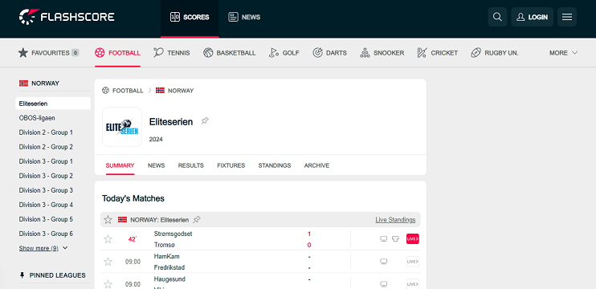

# flashscore-football-pyscraper

> football score scraper using `python` for [Flashscore](https://www.flashscore.co.uk/football/norway/eliteserien/)



```yaml
pandas
selenium
```

## Result

```yaml
flash_data.xlsx
```

&copy; 2024 @codeguru827

All rights reserved.
